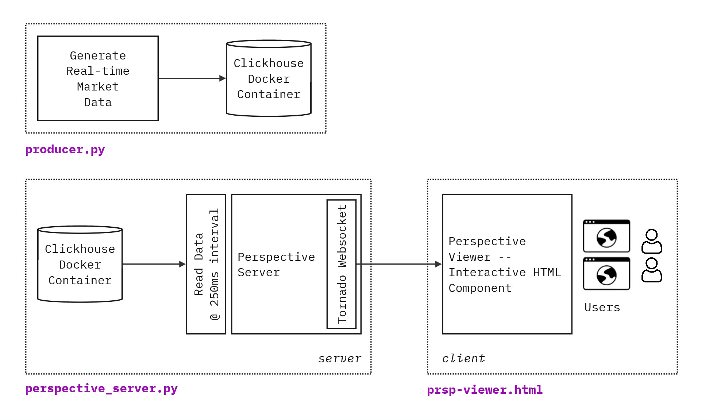

# Perspective <> Clickhouse Integration

This page demonstrates how to integrate Perspective with Clickhouse to visualize _fast-moving data streams_. By following this example, you will learn how to:

1. set up a connection between Perspective and Clickhouse.
1. Embed an interactive `<perspective-viewer>` in your web apps enabling real-time _data visualization_ and _analysis_.

## Overview

[Clickhouse](https://clickhouse.com/docs) is an open-source columnar database management system (DBMS) designed for online analytical processing (OLAP) of queries. It is known for its high performance, scalability, and efficiency in handling large volumes of data. 

Main Technical Advantages:
- _Columnar Storage:_ Optimized for reading and writing large datasets, making it ideal for analytical queries.
- _Compression:_ Efficient data compression techniques reduce storage costs and improve query performance.
- _Distributed Processing:_ Supports distributed query execution across multiple nodes, enhancing scalability and fault tolerance.
- _Real-time Data Ingestion:_ Capable of ingesting millions of rows per second, making it suitable for real-time analytics.

 

[Perspective](https://perspective.finos.org/) is an open-source data visualization library designed for real-time, fast-moving, and large data volumes. It provides a highly efficient and flexible way to visualize and analyze data streams in web applications.

Technical Advantages:
- _Real-time Visualization:_ Optimized for handling and rendering large datasets with minimal latency, making it ideal for dynamic and interactive data visualizations.
- _WebAssembly and Arrow:_ Utilizes WebAssembly and Apache Arrow to achieve unparalleled performance in data processing and rendering.
- _Multi-language Support:_ Offers support for multiple backends, including Python, Node.js, and Rust, allowing seamless integration into various development environments.

 

**Primary Use-cases:**

Together, _Clickhouse_ and _Perspective_ are widely used in industries such as finance, telecommunications, and e-commerce for applications that require real-time analytics and reporting. It excels in scenarios involving fast-moving or time-series data, such as:

- **Monitoring and Observability:** Real-time monitoring of system metrics and logs.
- **Financial Analytics:** High-frequency trading data analysis and risk management.
- **User Behavior Analytics:** Tracking and analyzing user interactions on websites and applications.
- **Real-time Ad and Impression Analytics:** Analyzing ad performance and user impressions in real-time to optimize marketing strategies.

 

## Demo Architecture & Components

This demo includes the following components:

- `docker.sh`: Starts a Clickhouse Docker container.
- `producer.py`: Generates a random stream of data and inserts it into Clickhouse every _250ms_.
- `perspective_server.py`: Reads the data stream from Clickhouse and sets up a _Perspective Server_. Multiple Perspective viewers (HTML clients) can then connect and provide interactive dashboards to users.
- `prsp-viewer.html`: Demonstrates how to embed an interactive `<perspective-viewer>` custom component in a web application.

 

## Getting Started
