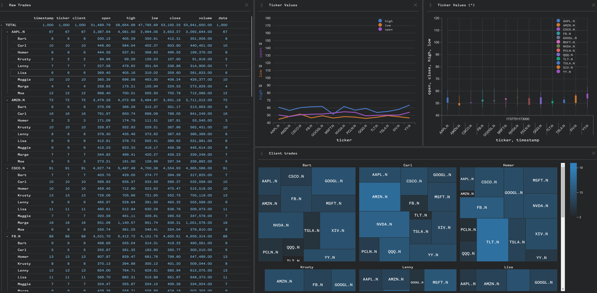

# Perspective <> Clickhouse Integration


<br/>

This guide demonstrates how to integrate Perspective with Clickhouse to visualize _fast-moving data streams_. By following this example, you will learn how to:

1. Set up a connection between Perspective and Clickhouse.
2. Embed an interactive `<perspective-viewer>` in your web apps enabling real-time _data visualization_ and _analysis_.

## Overview

[Clickhouse](https://clickhouse.com/docs) is an open-source columnar database management system (DBMS) designed for online analytical processing (OLAP) of queries. It is known for its high performance, scalability, and efficiency in handling large volumes of data. 

Main Technical Advantages:
- _Columnar Storage:_ Optimized for reading and writing large datasets, making it ideal for analytical queries.
- _Compression:_ Efficient data compression techniques reduce storage costs and improve query performance.
- _Distributed Processing:_ Supports distributed query execution across multiple nodes, enhancing scalability and fault tolerance.
- _Real-time Data Ingestion:_ Capable of ingesting millions of rows per second, making it suitable for real-time analytics.

<br/>

[Perspective](https://perspective.finos.org/) is an open-source data visualization library designed for real-time, fast-moving, and large data volumes. It provides a highly efficient and flexible way to visualize and analyze data streams in web applications.

Technical Advantages:
- _Real-time Visualization:_ Optimized for handling and rendering large datasets with minimal latency, making it ideal for dynamic and interactive data visualizations.
- _WebAssembly and Arrow:_ Utilizes WebAssembly and Apache Arrow to achieve unparalleled performance in data processing and rendering.
- _Multi-language Support:_ Offers support for multiple backends, including Python, Node.js, and Rust, allowing seamless integration into various development environments.

<br/>

**Primary Use-cases:**

Together, _Clickhouse_ and _Perspective_ are widely used in industries such as finance, telecommunications, and e-commerce for applications that require real-time analytics and reporting. It excels in scenarios involving fast-moving or time-series data, such as:

- **Monitoring and Observability:** Real-time monitoring of system metrics and logs.
- **Financial Analytics:** High-frequency trading data analysis and risk management.
- **User Behavior Analytics:** Tracking and analyzing user interactions on websites and applications.
- **Real-time Ad and Impression Analytics:** Analyzing ad performance and user impressions in real-time to optimize marketing strategies.

<br/>

## Demo Architecture & Components


This demo includes the following components:

- `docker.sh`: Starts a Clickhouse Docker container.
- `producer.py`: Generates a random stream of data and inserts it into Clickhouse every _250ms_.
- `server.py`: Reads the data stream from Clickhouse and sets up a _Perspective Server_. Multiple Perspective viewers (HTML clients) can then connect and provide interactive dashboards to users.
- `index.html`: Demonstrates how to embed an interactive `<perspective-viewer>` custom component in a web application.

<br/>

## Getting Started

### 1. Start a Clickhouse Docker Container

Start by pulling and running a Clickhouse docker container to host our demo data.

```bash
./docker.sh
```

This script performs the following actions:
- Pulls the latest Clickhouse Docker image and runs a new container called `prsp-clickhouse`.
- And it sets the database user/pass to `admin/admin123`.

<br/>

### 2. Set Up Python Virtual Environment

Next, create a new Python 3 virtual environment to manage the dependencies for this demo.

```bash
python3 -m venv venv
source venv/bin/activate
pip install -U pip
pip install -r requirements.txt
```

The `requirements.txt` includes packages for `clickhouse-connect` and `perspective-python`. The `perspective-python` package is the Python binding for Perspective, allowing you to create and manage Perspective tables, views, and servers. It facilitates the integration of real-time data visualization AND real-time publishing of data to Perspective Viewer clients.

<br/>

### 3. Run the Producer Script

The `producer.py` script is responsible for creating a Clickhouse table, generating random market data, and inserting it into the Clickhouse Docker container at regular intervals.

To run the producer script, execute the following command:

```bash
python producer.py
```

This script performs the following actions:
- Creates a table named `stock_values` to store the market data.
- Generates random market data, including timestamps, ticker symbols, client names, and stock prices.
- Inserts the generated data into the Clickhouse table every _250ms_.

<br/>

### 4. Run the Perspective Server


The `server.py` script is responsible for consuming data from Clickhouse, standing up a Perspective server, and refreshing data every _250ms_. It publishes changes to Perspective clients via a Tornado WebSocket.

Open a new terminal and activate your virtualenv. To run the Perspective server, execute the following command:

```bash
python server.py
```

This script performs the following actions:
- Connects to the Clickhouse database and reads the latest data from the `stock_values` table.
- Sets up a Perspective server that creates and manages a Perspective table with the data schema.
- Refreshes the data and updates the Perspective table.
- Publishes the changes to connected Perspective clients via a Tornado WebSocket, enabling real-time data visualization and interaction.

### 5. Open the Perspective Viewer

The final step is to open the `index.html` file in your web browser _(Chrome recommended)_. This file contains an embedded `<perspective-viewer>` component, which will enable interactive data visualization and automatically render data in real-time as new values are captured from the server.

Alternatively, you can use [https://perspective.co](https://perspective.co) (no login needed) to connect to your running Perspective server instead of using the local `index.html` file:

1. Go to [https://perspective.co](https://perspective.co) and create a new Project.
2. Open the **SOURCES** tab and create a new `Perspective://` data source.
3. The default connection parameters should work (it will connect to your local Perspective server WebSocket running via `server.py`).

This allows you to visualize your real-time data directly in the browser without any local setup.
<br/>

## Code Explained

### Perspective Server

The [`server.py`](./server.py) script is the backbone of the integration, responsible for setting up the Perspective server and managing real-time data updates. Here are the key components:

#### 1. Setting Up the Perspective Server

The Perspective server is created using the `perspective.Server()` class. This server will manage the Perspective tables and handle client connections.

```python
perspective_server = perspective.Server()
```

#### 2. Creating a Perspective Table

A new Perspective table is created with a defined schema. This table will store the data read from Clickhouse and will be updated periodically.

```python
schema = {
    "timestamp": "datetime",
    "ticker": "string",
    "client": "string",
    "open": "float",
    "high": "float",
    "low": "float",
    "close": "float",
    "volume": "float",
    "date": "date",
}
table = perspective_server.new_local_client().table(schema, limit=1000, name=TABLE_NAME)
```

`TABLE_NAME` is the name of the websocket table that we'll later use to connect from our Perspective Viewer client.

#### 3. Updating the Perspective Table

The `updater` function reads data from Clickhouse and updates the Perspective table. This function is called periodically to ensure the table contains the latest data.

```python
def updater():
    data = read_data_from_clickhouse(clickhouse_client)
    table.update(data)
    logger.debug(f"Updated Perspective table with {len(data)} rows")
```

The `tornado.ioloop.PeriodicCallback()` is used to call the `updater` function periodically, ensuring the Perspective table is refreshed with the latest data from Clickhouse at regular intervals.

```python
# start the periodic callback to update the table data
callback = tornado.ioloop.PeriodicCallback(callback=updater, callback_time=(INTERVAL * 1000))
callback.start()
```

#### 4. Setting Up the Tornado WebSocket

The Tornado WebSocket is set up to serve the Perspective table to connected clients. This allows real-time data updates to be pushed to the clients.

```python
def make_app(perspective_server):
    return tornado.web.Application([
        (r"/websocket", perspective.handlers.tornado.PerspectiveTornadoHandler, {"perspective_server": perspective_server}),
    ])
```

#### 5. Running the Server

Finally, the Tornado IOLoop is started to run the server and handle incoming connections.

```python
app = make_app(perspective_server)
app.listen(8080)
loop = tornado.ioloop.IOLoop.current()
loop.call_later(0, perspective_thread, perspective_server, clickhouse_client)
loop.start()
```

These components work together to create a robust system for real-time data visualization using Perspective and Clickhouse.


### Perspective Viewer (client)

The [`index.html`](./index.html) file is responsible for embedding the Perspective Viewer component in a web application and connecting it to the Perspective server to visualize real-time data. Here are the key components:

#### 1. HTML Structure

The HTML structure includes a `<perspective-viewer>` element wrapped inside a container. This element will render the interactive data visualizations.

```html
<div id="viewer-container">
    <perspective-viewer id="prsp-viewer" theme="Pro Dark"></perspective-viewer>
</div>
```

#### 2. Importing Perspective Modules

The necessary Perspective modules are imported to enable the functionality of the Perspective Viewer.

```html
<script type="module" src="https://cdn.jsdelivr.net/npm/@finos/perspective/dist/cdn/perspective.js"></script>
<script type="module" src="https://cdn.jsdelivr.net/npm/@finos/perspective-viewer/dist/cdn/perspective-viewer.js"></script>
<script type="module" src="https://cdn.jsdelivr.net/npm/@finos/perspective-viewer-datagrid/dist/cdn/perspective-viewer-datagrid.js"></script>
<script type="module" src="https://cdn.jsdelivr.net/npm/@finos/perspective-viewer-d3fc/dist/cdn/perspective-viewer-d3fc.js"></script>
```

#### 3. Connecting to the Perspective Server

A script is included to connect the Perspective Viewer to the Perspective server via WebSocket. It loads the data from the server into the viewer.

```html
<script type="module">
    import perspective from "https://cdn.jsdelivr.net/npm/@finos/perspective@3.1.3/dist/cdn/perspective.js";

    document.addEventListener("DOMContentLoaded", function() {
        async function load_viewer() {
            const table_name = "stock_values";
            const viewer = document.getElementById("prsp-viewer");
            const websocket = await perspective.websocket("ws://localhost:8080/websocket");
            const server_table = await websocket.open_table(table_name);
            await viewer.load(server_table);
        }
        load_viewer();
    });
</script>
```

<br/>

## Prospective.co



Alternatively, you can use [https://perspective.co](https://perspective.co) (no login needed) to connect to your running Perspective server instead of using the local `index.html` file:

1. Go to [https://perspective.co](https://perspective.co) and create a new Project.
2. Open the **SOURCES** tab and create a new `perspective://` data source.
3. The default connection parameters should work (it will connect to your local Perspective server WebSocket running via `server.py`).

This allows you to visualize your real-time data directly in the browser without any local setup.

These components work together to create an interactive and real-time data visualization experience using Perspective and Clickhouse.

<br/>

[Prospective.co](https://prospective.co), the commercial version of Perspective, offers additional functionality and capabilities, including a built-in _Perspective Server_ data connector. This allows users to build, customize, and share dashboards based on Clickhouse data seamlessly.

Prospective.co is free to use with limited data connectors; to get a trial license of Prospective, send an email to _hello@prospective.co_ with the subject: _"Clickhouse trial"_.

<br/>

## Conclusion

For any additional questions or further assistance, please feel free to email me at _parham@prospective.co_.

Thank you for following this guide!
