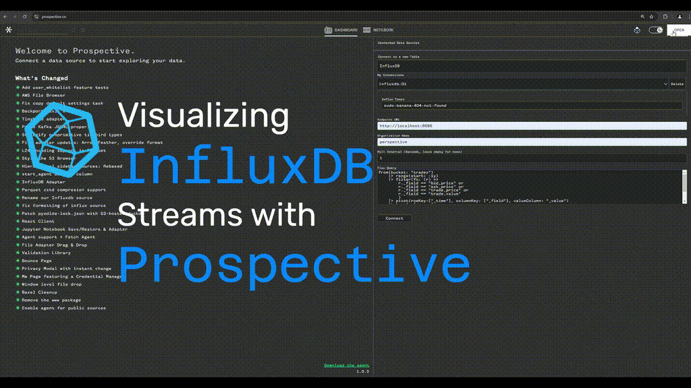
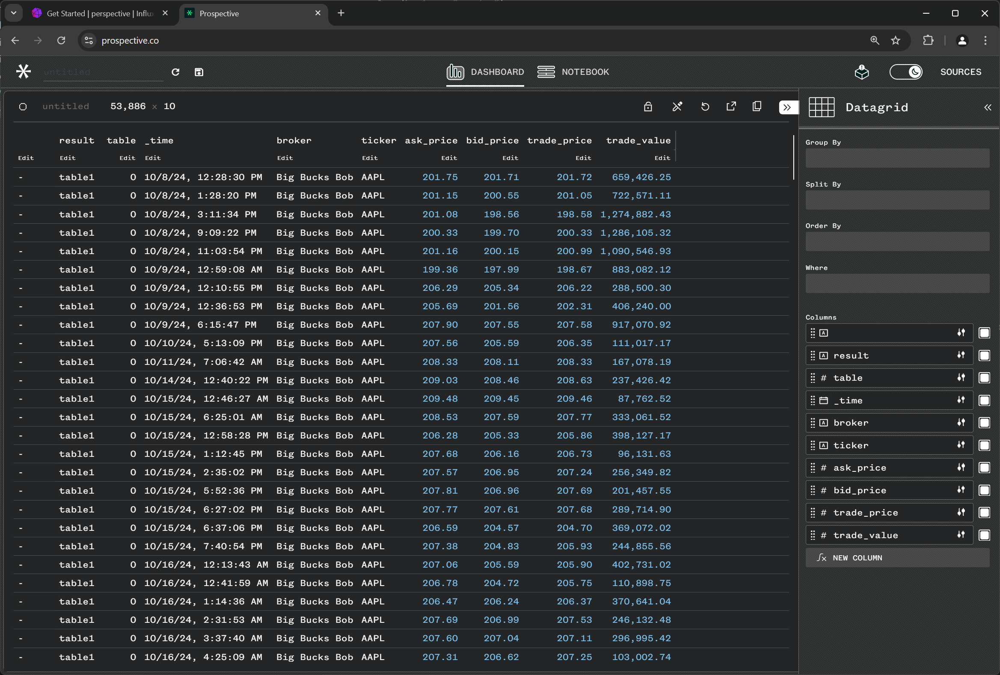
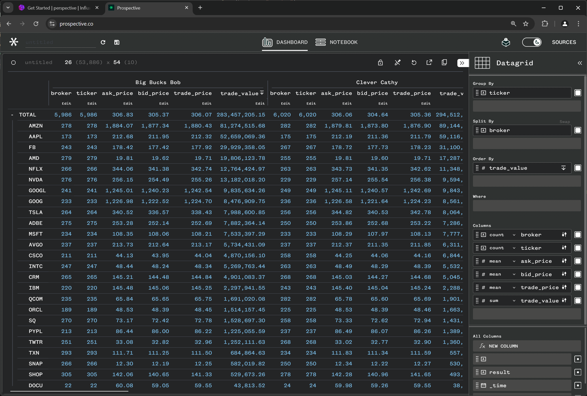

# Prospective <> InfluxDB integration

## Analyze InfluxDB time-series data in a Tableau-like Interface

Welcome to the Prospective InfluxDB Integration Sample Project!

<br/>

This is an example project to showcases how to use Prospective's data visualization capabilities with InfluxDB, a popular time-series database. In this guide, you'll find detailed instructions on how to set up and run the sample integration to explore historical stock market trade data.



## Table of Contents

- [Prospective \<\> InfluxDB integration](#prospective--influxdb-integration)
  - [Analyze InfluxDB time-series data in a Tableau-like Interface](#analyze-influxdb-time-series-data-in-a-tableau-like-interface)
  - [Table of Contents](#table-of-contents)
  - [Features](#features)
  - [Getting Started](#getting-started)
    - [Requirements](#requirements)
    - [Setting up InfluxDB](#setting-up-influxdb)
  - [Example Dataset](#example-dataset)
  - [Exploring the Dataset using Flux Dashboard](#exploring-the-dataset-using-flux-dashboard)
  - [Visualization in Prospective](#visualization-in-prospective)

## Features

- Integrate InfluxDB with [Prospective]\([https://perspective.finos.org/](https://perspective.finos.org/)), a modern data visualization platform for real-time data streams.
- Prospective connectors allows continuous pull of data from influxdb.
- Customize pull interval and flux query used to pull data.
- Demonstrates using Prospective to visualize time-series data from InfluxDB in a Tableau-like interface.
- Supports multiple data scales (small to medium datasets) to highlight different performance levels.

<br/>

## Getting Started

### Requirements

- **Trial login:** To get a trial Prospective license, email [hello@prospective.co](mailto\:hello@prospective.co) with the subject: *"influxdb trial login"* .
- **Docker**: Make sure Docker is installed and running on your machine.

### Setting up InfluxDB

1. Clone the Git repo:

   ```bash
   git clone https://github.com/ProspectiveCo/perspective-examples.git
   ```


2. **Start the InfluxDB Docker Container**

   Run the `start_influxdb.sh` script to set up and start an InfluxDB instance in Docker:

   ```bash
   cd examples/influxdb/influxdb-docker
   ./start_influxdb.sh
   ```

   This script will:

   - Pull the InfluxDB Docker image if it's not already present.
   - Set up and start the container, configuring it with default user credentials and a token.
   - Load the **trades-md.tar.gz** (54K records)  into InfluxDB.


3. **Access InfluxDB**
   Once the container is running, InfluxDB's web interface is accessible at [http://localhost:8086](http://localhost:8086). You can log in using the credentials defined in the script `admin / sudo-banana-404`.


4. **Stop the InfluxDB Container**
   To stop and remove the container, run:

   ```bash
   ./stop_influxdb.sh
   ```

<br/>

## Example Dataset

The sample data simulates historical stock market trades and includes multiple datasets of different sizes:

- **trades-lg.tar.gz**: Contains 1.2 million rows (not loaded by default).
- **trades-md.tar.gz**: Contains 54,000 rows of historical trade data (loaded into InfluxDB).
- **trades-sm.csv**: Contains 5 sample rows for quick exploration (loaded into InfluxDB).

Here's a preview of the `trades-sm.csv` dataset:

| Timestamp           | Ticker | Broker       | Bid Price | Ask Price | Trade Price | Bid Spread | Shares | Trade Value | Open Price | Close Price | Date       |
| ------------------- | ------ | ------------ | --------- | --------- | ----------- | ---------- | ------ | ----------- | ---------- | ----------- | ---------- |
| 1483401739000000000 | GOOGL  | Clever Cathy | 805.5713  | 810.5778  | 805.6254    | 5.0065     | 50     | 40281.2711  | 800.619995 | 808.01001   | 2017-01-03 |

The dataset includes details like ticker symbols, broker names, bid and ask prices, trade prices, and timestamps, making it suitable for demonstrating rich data visualization with Prospective.

## Exploring the Dataset using Flux Dashboard

Once the database is set up, log into the InfluxDB dashboard at [http\://localhost:8086](http\://localhost:8086) using the following credentials:

```
Username: admin
Password: sudo-banana-404
```

Once logged in, you can start exploring the data using InfluxDB's query interface or the provided [`sample\_queries.flux`](./sample_queries.flux).

<br/>

## Visualization in Prospective

To obtain a trial Prospective license, email [hello@prospective.co](mailto\:hello@prospective.co) with the subject: "influxdb trial login".

<video width="600" controls>
  <source src="imgs/influxdb_connector_compressed.mp4" type="video/mp4">
  Your browser does not support the video tag.
</video>


To visualize the loaded InfluxDB data using Prospective:

1. Log into [https://prospective.co/](https://prospective.co/)

2. Open "SOURCES" tab and select "InfluxDB" from the dropdown list.
   
   

3. Enter the influxdb connection info:

   ```
   Endpoint URL: localhost:8080
   Token: sudo-banana-404-not-found
   Organization: perspective
   ```

4. You should see the data imported from influxdb instance.


5. Explore the interface by choosing chat types, adding group bys, and changing aggregation functions:

    


