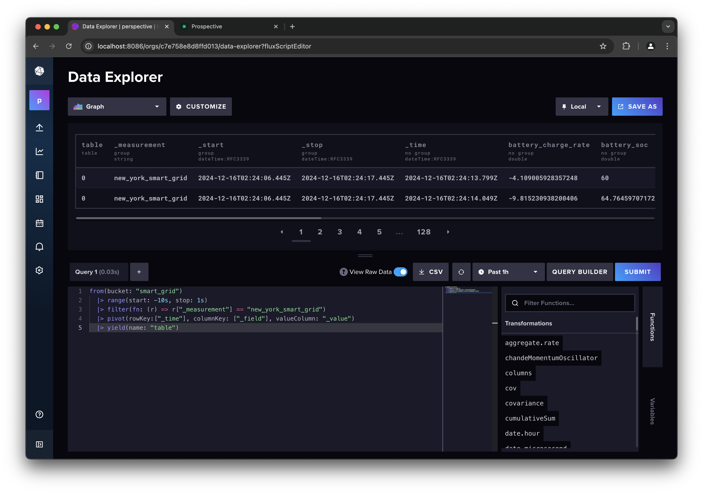

# InfluxDB -> Prospective Demo

This page provides instructions on running the InfluxDB to Prospective demo, which showcases the integration of InfluxDB with Prospective using a smart grid data generator for New York City. The demo involves generating streaming data and pushing it to InfluxDB for real-time visualization with Prospective.

## InfluxDB

InfluxDB is a high-performance time-series database designed for handling large volumes of time-stamped data. It is widely used for monitoring, analytics, and IoT applications due to its strengths in:

- *High Write Throughput*: Capable of ingesting millions of data points per second.
- *Efficient Storage*: Optimized for time-series data, providing efficient storage and retrieval.
- *Powerful Query Language*: Supports complex queries with its InfluxQL and Flux languages.
- *Real-Time Analytics*: Ideal for applications requiring real-time data processing and visualization.


InfluxDB excels in scenarios where real-time data ingestion and analysis are critical. Common use cases include:

- IoT Monitoring: Collecting and analyzing sensor data from connected devices.
- Financial Analytics: Tracking and analyzing stock market data.
- Performance Monitoring: Monitoring system and application performance metrics.
- Smart Grid Management: Managing and analyzing data from power grids.

## Prospective

Prospective is a powerful data visualization tool designed to handle real-time streaming data with ease. It excels in providing interactive and dynamic visualizations, making it an ideal choice for applications that require up-to-the-minute data insights. Key features of Prospective include:

- *Real-Time Data Handling*: Capable of ingesting and visualizing streaming data in real-time, ensuring that users always have the most current information at their fingertips.
- *Interactive Dashboards*: Allows users to create highly interactive and customizable dashboards, enabling deep dives into data trends and patterns.
- *Scalability*: Designed to handle large volumes of data efficiently, making it suitable for enterprise-level applications.
- *Integration with InfluxDB*: Seamlessly integrates with InfluxDB, allowing users to visualize time-series data stored in InfluxDB with minimal setup.
- *Rich Visualization Options*: Offers a wide range of visualization types, including line charts, bar charts, heatmaps, and more, to cater to diverse data analysis needs.

By leveraging Prospective, users can transform raw streaming data into actionable insights through intuitive and visually appealing dashboards, enhancing their ability to monitor and respond to real-time events effectively.

#### 1. Setup

Start by cloning the demo repository:

```bash
git clone https://github.com/ProspectiveCo/perspective-examples.git
```

Now, let's setup a python virtualenv and install dependencies:

```bash
cd perspective-examples
python3 -m venv venv
source venv/bin/activate
pip install --upgrade pip
pip install -r requirements.txt
```

#### 2. Start InfluxDB Docker Container

To start the InfluxDB Docker container, navigate to the `examples/influxdb/streaming` directory and run the provided setup script:

```bash
cd examples/influxdb/influxdb-docker
./start_influxdb.sh
```

This script contains the code to start and setup an influxdb container with the following configuration:

```bash
# This script runs an InfluxDB container with the following configuration:
docker run -d --rm \
    --name "influxdb_perspective" \
    -p 8086:8086 \
    -e DOCKER_INFLUXDB_INIT_MODE=setup \
    -e DOCKER_INFLUXDB_INIT_USERNAME="admin" \
    -e DOCKER_INFLUXDB_INIT_PASSWORD="sudo-banana-404" \
    -e DOCKER_INFLUXDB_INIT_ORG="perspective" \
    -e DOCKER_INFLUXDB_INIT_BUCKET="smart_grid" \
    -e DOCKER_INFLUXDB_INIT_ADMIN_TOKEN="sudo-banana-404" \
    "influxdb:2"
```

Please note the following:
- Influxdb is initiated with `DOCKER_INFLUXDB_INIT_USERNAME` and `DOCKER_INFLUXDB_INIT_PASSWORD` set to "admin" and "sudo-banana-404".
- Influxdb API token is also set to `sudo-banana-404`.
- We initiate the container with a buket: "smart_grid"

You can now log into the influxdb dashboard: [http://localhost:8086/](http://localhost:8086/). Use `admin` and `sudo-banana-404` as user/pass.


#### 3. Smart Grid NYC Data Generator

Let's start streaming data into the influxdb bucket... 

The smart grid data generator simulates real-time data for New York City's power grid. It generates data points for various power stations, including metrics such as energy consumption, voltage, current, and more. The generated data is pushed to InfluxDB for real-time analysis and visualization.

Run `main.py` which will start the generator and start streaming to influxdb:

```bash
python examples/influxdb/streaming/main.py
```

Let's dig into the code:

```python
"""
Start a smart_grid streaming data generator and send the data to InfluxDB.
"""

# add the project root dir to the python path for modules to import correctly
import os
import sys
sys.path.append('../../../')

from datetime import datetime, timedelta
from time import sleep
from utils.logger import logger
from utils.config_loader import config
from generators.smart_grid.new_york_smart_grid import NewYorkSmartGridStreamGenerator
from writers.influxdb_writer import InfluxdbWriter


# ============================================
# DEMO CONFIGURATION PARAMETERS
# change these parameters to customize the demo
# ============================================
START_TIME = datetime.now() - timedelta(minutes=0)                  # demo start time
END_TIME = datetime.now() + timedelta(minutes=30, seconds=0)        # demo end time
INFLUXDB_URL = 'http://localhost:8086'
INFLUXDB_TOKEN = 'sudo-banana-404'
INFLUXDB_ORG = 'perspective'
INFLUXDB_BUCKET = 'smart_grid'


def main():
    logger.info('-' * 80)
    logger.info('DEMO: INFLUXDB -> PROSPECTIVE')
    logger.info('Starting smart grid streaming data generator...')
    logger.info('Sending data to InfluxDB...')

    # --------------------------------------------
    # DATA GENERATORS & WRITERS

    smart_grid = NewYorkSmartGridStreamGenerator(
        interval=0.250,         # refresh every 0.25 seconds
        nrows=100,              # number of rows to generate in each batch
        num_stations=32,        # number of stations
        start_time=START_TIME,  # start time
        end_time=END_TIME,      # end time
        loopback=True,          # loopback if we exhaust the generated data
        )

    # Define the InfluxDB writer
    influx_writer = InfluxdbWriter(
        url=INFLUXDB_URL,
        token=INFLUXDB_TOKEN,
        org=INFLUXDB_ORG,
        bucket=INFLUXDB_BUCKET,
        measurement='new_york_smart_grid',
        timestamp_col='timestamp',
        tag_cols=['station_name', 'latitude', 'longitude'],
        field_cols=['energy_consumption', 'current', 'voltage', 'status', 'power_factor', 'battery_soc', 'battery_charge_rate', 'renewable_power_generation', 'transformer_temperature'],
        )
    
    # attach data writers to the generators
    smart_grid.add_subscriber(influx_writer)
    # setup complete
    logger.info('Setup complete. Starting data generation...')

    # --------------------------------------------
    # MAIN STREAMING LOOP
    smart_grid.start()
    # wait for the demo loop to finish or until the user interrupts
    try:
        while smart_grid.is_running():
            sleep(1)
    except KeyboardInterrupt:
        logger.info('Demo: Execution interrupted by the user. Ending demo...')
        smart_grid.stop()
    finally:
        # Ensure the InfluxDB writer is closed properly
        smart_grid.stop()
        influx_writer.close()
        del influx_writer
        del smart_grid
        logger.info('Demo: Ended New York Smart Grid demo.')


if __name__ == '__main__':
    main()

```

This script initializes the data generator and configures it to send data to InfluxDB at regular intervals (every 250ms). Please pay attention to the following:

- `START_TIME` sets the start of stream to now (with offset of 0 mintues).
- `END_TIME` sets the end of stream to 30 minutes from now.
- `NewYorkSmartGridStreamGenerator` is the class simulating an smart grid data for New York city power stations. You can follow the code in [`generators/smart_grid/new_york_smart_grid.py`]().
- The script also adds a `InfluxdbWriter()` class which streams data to influxdb. You can follow the code in: [`writers/influxdb_writer.py`]().

This will start a background thread which continuously generates and streams data. The main loop can be stopped at any time with CTRL + C. 


#### 4. InfluxDB Dashboard

Let's first start by inspecting the data with the influxdb dashabord: 

- Navigate to Data Explorer on the left panel
- Switch the Script Editor
- Flip the View Raw Data toggle
- Enter the following influxdb query:

```influxql
from(bucket: "smart_grid")
  |> range(start: -1m, stop: 1s)
  |> filter(fn: (r) => r["_measurement"] == "new_york_smart_grid")
  |> pivot(rowKey:["_time"], columnKey: ["_field"], valueColumn: "_value")
  |> yield(name: "table")
```

You can see that the data is being streamed properly:



#### 5. Prospective Dashboard


Prospective provides a powerful, client-side visualization tool for real-time analytics. Prospective also provides a built-in data adapter to InfluxDB. By using the InfluxDB adapter, you can create interactive dashboards to visualize streaming data from the smart grid data generator.

In a new tab, navigate to [https://prospective.co/](https://prospective.co/).

To obtain a trial license of Prospective please send an email to `hello@prospective.co` with the subject: "InfluxDB blog".

Login with your credentials.


Click on Create New Dashboard and open the SOURCES tab on the top right corner:

- From the drop down choose InfluxDB
- Enter influxdb toekn: "sudo-banana-404"
- Set the endpoint URL: "http://localhost:8086"
- Set organization to: "perspective" and data pull interval to `0.5` seconds
- Use the same influxdb query:

```influxql
from(bucket: "smart_grid")
  |> range(start: -1m, stop: 1s)
  |> filter(fn: (r) => r["_measurement"] == "new_york_smart_grid")
  |> pivot(rowKey:["_time"], columnKey: ["_field"], valueColumn: "_value")
  |> yield(name: "table")
```


You can now see the data being imported into the Data Grid view and refreshed every 500ms:


You can start interacting and adjusting the view. Click the dashboard title called "untitled" on the top left corner to open the configuration tab.

Once the configration tab is opened on the right, you can adjust the view setting. Try grouping by station_name and deactive some of the columns to show:


Try other chart types by clicking the Data Grid tab and switching to Treemap or other chart types. Play around!


Probably the best view for this data, is using the Map Scatter plot. Choose Map Scatter, then extend the `Debug JSON` tab by clicking the **`<<`** icon to the top right. Enter the following JSON config view:

```json
{
  "version": "3.2.0",
  "plugin": "Map Scatter",
  "plugin_config": {
    "center": [
      -8228659.670691408,
      4974253.000191102
    ],
    "zoom": 12
  },
  "columns_config": {},
  "settings": true,
  "theme": "Pro Dark",
  "title": null,
  "group_by": [
    "station_name"
  ],
  "split_by": [
    "status"
  ],
  "columns": [
    "longitude",
    "latitude",
    null,
    "energy_consumption",
    null
  ],
  "filter": [],
  "sort": [],
  "expressions": {
    "ts1": "bucket(\"_time\", '1m')"
  },
  "aggregates": {
    "latitude": "last",
    "energy_consumption": "mean",
    "longitude": "last"
  }
}
```

Perspective views can easily be saved to and imported from JSON config. This will initialize the perspective dashabord with all the correct setting.

Perspective viewer pulls data from influxdb at every 500ms interval and refreshes the view. You can see the live power consumption for each station and stations switch ON/OFF regularly based on power outages!


## Conclusion

This demo showcases the seamless integration of InfluxDB and Prospective for real-time data visualization. By following the steps outlined, you can set up an InfluxDB instance, generate and stream smart grid data, and visualize it using Prospective's powerful dashboard capabilities. This setup is ideal for applications requiring real-time data insights, such as IoT monitoring, financial analytics, and smart grid management. With InfluxDB's high-performance time-series data handling and Prospective's interactive visualizations, you can transform raw data into actionable insights efficiently.

For more details on setting up and using Prospective, refer to the [Prospective documentation](https://perspective.finos.org/).

