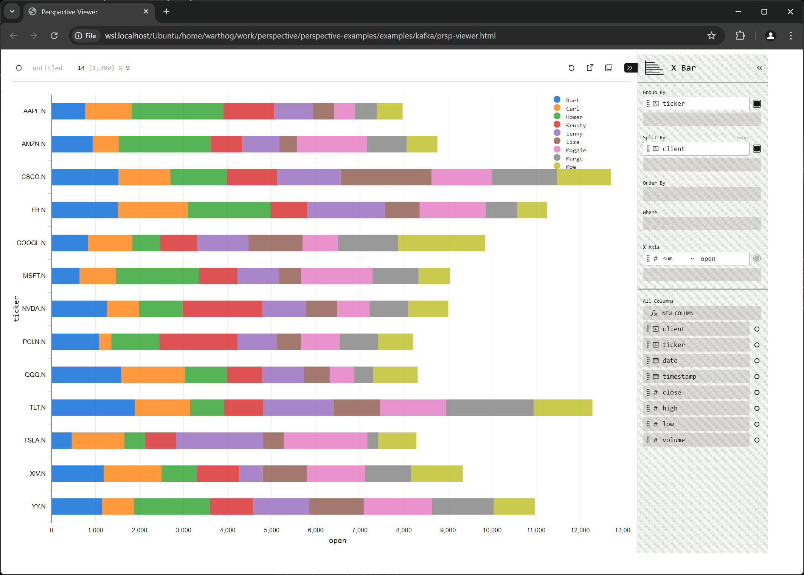
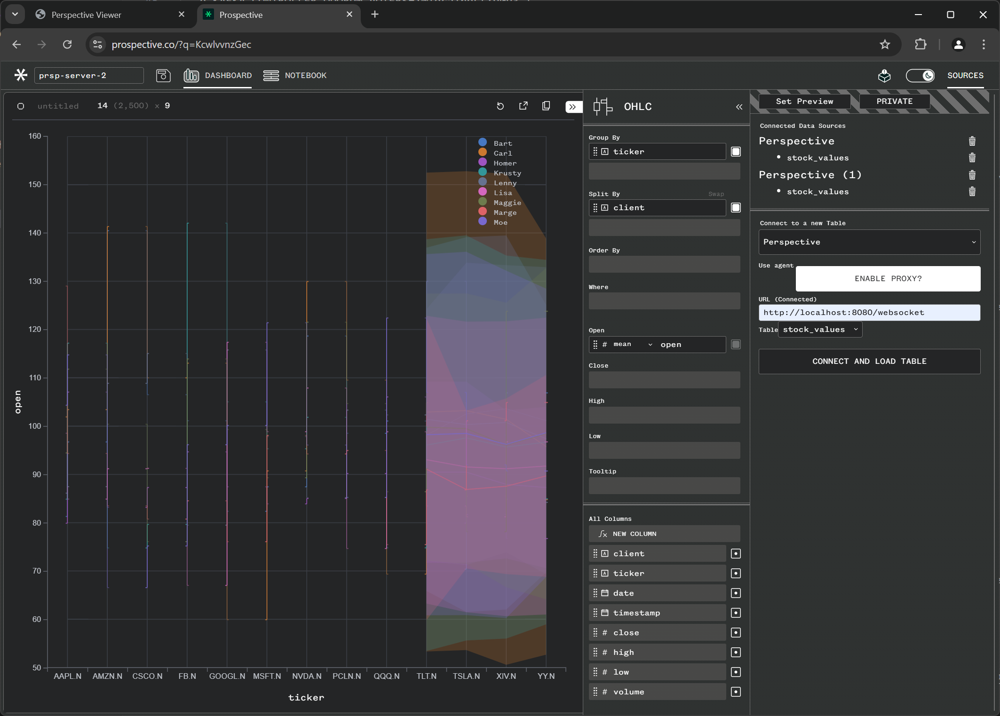

# Perspective <-> Kafka real-time Data Stream

This demo demonstrates how to build a real-time client/server app between Kafka + Perspective Tornado Server and Perspective Viewer on the client side.

### Setup

#### 1. Create a python virtualenv and install pip packages:

```bash
cd perspective-examples

# create a virtualenv and install packages
python3 -m venv venv
source venv/bin/activate
pip install --upgrade pip
pip install -r requirements.txt
```

#### 2. Switch into this dir

```bash
cd examples/kafka
```

#### 3. Start a Kafka docker container

The [`kafka_container.sh`](./kafka_conrainer.sh) script starts a local docker container:

```bash
./kafka_container.sh
```

You can inspect the code:

```bash
docker run -d  \
  --name kafka \
  -p 9092:9092 \
  -e KAFKA_NODE_ID=1 \
  -e KAFKA_PROCESS_ROLES=broker,controller \
  -e KAFKA_LISTENERS=PLAINTEXT://:9092,CONTROLLER://:9093 \
  -e KAFKA_ADVERTISED_LISTENERS=PLAINTEXT://localhost:9092 \
  -e KAFKA_CONTROLLER_LISTENER_NAMES=CONTROLLER \
  -e KAFKA_LISTENER_SECURITY_PROTOCOL_MAP=CONTROLLER:PLAINTEXT,PLAINTEXT:PLAINTEXT \
  -e KAFKA_CONTROLLER_QUORUM_VOTERS=1@localhost:9093 \
  -e KAFKA_OFFSETS_TOPIC_REPLICATION_FACTOR=1 \
  -e KAFKA_TRANSACTION_STATE_LOG_REPLICATION_FACTOR=1 \
  -e KAFKA_TRANSACTION_STATE_LOG_MIN_ISR=1 \
  -e KAFKA_GROUP_INITIAL_REBALANCE_DELAY_MS=0 \
  -e KAFKA_NUM_PARTITIONS=1 \
  apache/kafka:latest
```

#### 4. Start a Producer

The [`producer.py`](./producer.py) script generates random stock values and writes them to a Kafka topics at every 250ms interval. Run the producer to start generating data:

```bash
python producer.py
```

#### 5. Start a Perspective Tornado Server

The [`perspective_server.py](./perspective_server.py) contains the main logic of this demo. It starts a Perspective Tornado server and create a Perspective Table. It then reads messages from the kafka topic (every 250ms) and streams it a websocket using a Tornado server.

Start a new command terminal, load your virtualenv, and run the Perspective Server:

```bash
# start a new terminal
cd perspective-examples
source venv/bin/active
cd examples/kafka
python perspective_server.py
```

You can CTRL + C to shutdown the server at any point.

#### 6. Load the Perspective Viewer HTML Dashboard

Open [`prsp-viewer.html`](./prsp-viewer.html) in your browser. This page includes a `<perspective-viewer>` HTML tag that connects to the Perspective server and renders the data continuously on the screen.



#### 7. Prospective.co

Alternatively, you can use our commercial Prospective.co product to view the data. Log into [https://prospective.co](https://prospective.co) with your credentials.

1. Start a new Dashboard.
2. Choose "Perspective" from the SOURCES tag (top right)
3. Enter the websocker URL: `http://localhost:8080/websocket`
4. And pick the table from the dropdown list




