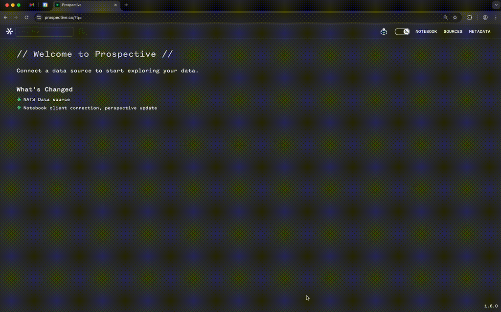
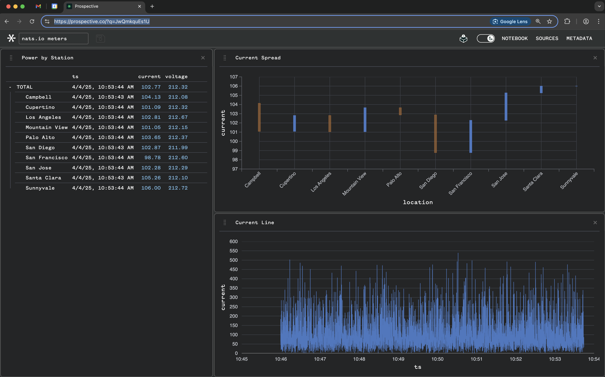
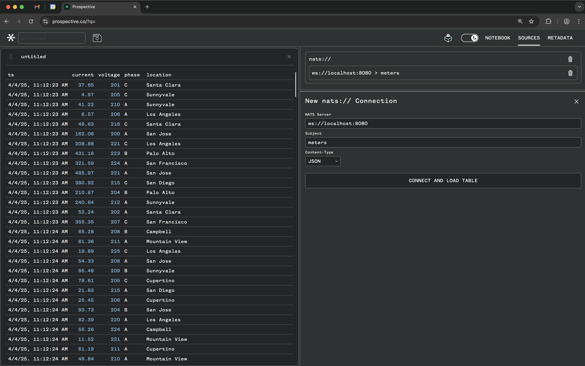

# NATS.io <> Perspective - Real-Time Data Visualization

This guide demonstrates how to visualize records from [NATS.io](https://nats.io/) in real-time using [Perspective](https://perspective.finos.org/) (commercial version: Prospective). By combining these technologies, you can stream data from NATS.io and interactively analyze it in real-time dashboards.



---

## Introduction

### What is Perspective?

[Perspective](https://perspective.finos.org/) is a high-performance data visualization library designed for real-time analytics. It enables users to create dynamic dashboards, charts, and tables that update in real-time, making it ideal for time-series and streaming data.

### What is NATS.io?

[NATS.io](https://nats.io/) is a lightweight, high-performance messaging system designed for distributed systems. It supports real-time data streaming and is widely used for building scalable, event-driven architectures.

<br/><br/>

## Goal and Steps

The goal of this guide is to stream records into NATS.io and visualize them in real-time using the Prospective NATS.io adapter. The steps include:

1. Starting a NATS.io server with WebSocket support.
2. Installing Node.js packages.
3. Running the `producer.js` script to publish records to NATS.io.
4. Using the Prospective NATS.io adapter to connect to the NATS server and visualize the data.
5. Interacting with the Prospective dashboards to analyze the data.
6. Tearing down the demo.

<br/>



<br/>

---

## Getting Started

### Step 1: Start the NATS.io Server

Start a NATS.io server with WebSocket support using Docker. Start a new terminal and run:

```bash
cd examples/nats.io/
./docker.sh
``` 

<br/>

How it works...

This script starts a NATS.io docker container with a `nats.conf` configuration file with the following content:

```conf
# nats.conf
websocket {
  listen: "0.0.0.0:8080"
  no_tls: true
}
```

This starts the NATS server on the default port `4222` for NATS clients and `8080` for WebSocket connections:

```bash
docker run -d --name nats -p 4222:4222 -p 8080:8080 -v $(pwd)/nats.conf:/nats.conf nats:latest -c /nats.conf
```

---

### Step 2: Install Node.js Packages

Before running the producer script, install the required Node.js packages. These include the `@nats-io/transport-node` library, which provides the NATS client for Node.js. Refer to the [NATS.io documentation](https://docs.nats.io/) for more details.

Run the following command in the `node` directory:

```bash
cd examples/nats.io/node
npm install
```

This will install all dependencies listed in the `package.json` file.

---

### Step 3: Run the Producer Script

Run the `producer.js` script to generate and publish records to the NATS subject `meters`:

```bash
cd examples/nats.io/node
node producer.js
```

<br/>

The script connects to the NATS server and publishes random power-line data at regular intervals. Here's a snippet of how the data is generated:

```javascript
function generateData(num_rows = NUM_ROWS_PER_INTERVAL) {
    const modifier = Math.random() * (Math.random() * 50 + 1);
    return Array.from({ length: num_rows }, (_, i) => ({
        ts: new Date().toISOString(),
        current: Math.random() * 75 + Math.random() * 10 * modifier,
        voltage: Math.floor(Math.random() * 26) + 200,
        phase: PHASE[Math.floor(Math.random() * PHASE.length)],
        location: LOCATIONS[Math.floor(Math.random() * LOCATIONS.length)],
    }));
}
```

The script publishes this data to the NATS subject `meters`:

```javascript
await nc.publish(NATS_SUBJECT, payload);
console.log(`Published to subject: "${NATS_SUBJECT}", num rows: ${num_rows}`);
```

---


### Step 4: Log in to Prospective.co

To visualize the data, log in to [Prospective.co](https://prospective.co/). If you don't have an account, create one by navigating to **LOGIN > CREATE AN ACCOUNT** or email `hello@prospective.co` for a trial license.

---

### Step 5: Configure the NATS.io Adapter

1. Open the SOURCE tab on the top right.
1. Click on the NATS.io adapter.
1. Set the **Server URL** to `ws://localhost:8080`.
1. Set the **Subject Name** to `meters`.
1. Press **Connect** to start streaming data.

You should see records pouring into the dashboard in real-time.



---

### Step 6: Tear Down the Demo

To stop the demo:

1. Press `CTRL+C` in the terminal running the `producer.js` script to stop it.
2. Stop the NATS.io Docker container by running:

   ```bash
   docker stop nats && docker rm nats
   ```

This will stop and remove the NATS.io container.

---

### Conclusion

By integrating NATS.io with Perspective, you can build a robust, real-time data visualization platform. This guide demonstrated how to stream data into NATS.io and visualize it using the Prospective NATS.io adapter. Explore further customization options to adapt this setup for your specific use case.
