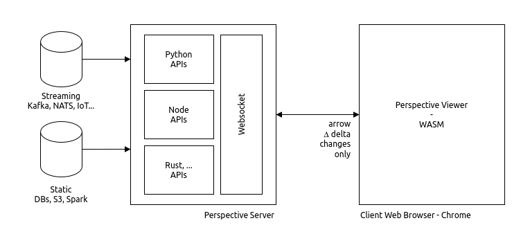
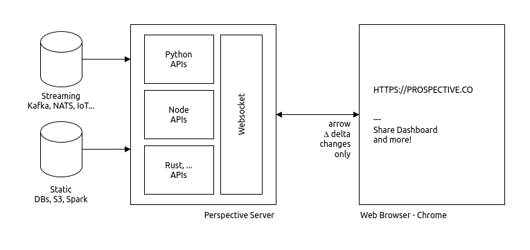

# Perspective Server / Client Architecture



This directory provides examples of setting up a Perspective server/client architecture, where the server uses Python or Node.js APIs to connect to static or streaming data sources and updates Perspective viewers in a web browser for real-time interaction.

<br/>


> **NOTE:** his example is using Perspective version **3.4.3**. You can modify the code to use a different version by selecting your desired release from the [Perspective releases page](https://github.com/finos/perspective/releases).

## Components

#### 1. Perspective Server

Perspective provides [Python](https://perspective.finos.org/guide/how_to/python/installation.html), [Node.js](https://perspective.finos.org/guide/how_to/javascript/installation.html), and [Rust](https://perspective.finos.org/guide/how_to/rust.html) APIs, enabling users to connect to real-time or batch data sources and stream results to Perspective viewers (clients) via WebSocket. The architecture is consistent across APIs.

- **Python**: This example uses the `perspective-python` package with a Tornado server and `PerspectiveTornadoHandler` to establish the WebSocket. Other frameworks like **FastAPI** or Asyncio can be easily substituted.

- **Node.js**: The example uses the `@finos/perspective` npm package and `perspective.WebSocketServer` to start the WebSocket server.

Both examples generate random stock market data updating every **250 milliseconds**, showcasing high-speed updates. In real-world scenarios, this logic can be replaced to fetch data from the desired source at custom intervals.

<br/>

> **NOTE:** Data updates are handled asynchronously, ensuring the main server (Tornado or Node.js) event loop remains non-blocking.

#### 2. Perspective Client

The client is a web application that connects to the Perspective server via WebSocket. It uses a custom WebAssembly-based `<perspective-viewer>` HTML component in a web browser, allowing users to interactively analyze and visualize data. The client can be built using any web framework (e.g., React, Vue, Angular) or even plain HTML/JavaScript.

In these examples we use a simple HTML page with a `<perspective-viewer>` component to display the data.

#### 3. Data Transport Layer

We use WebSocket as the transport layer, allowing real-time updates and low-latency communication between the server and client. Perspective accomplishes very fast updates between the server and client using Arrow IPC and only transferring delta updates to the client.

<br/>

### Python Example

Navigate to the [python](./python/) directory.

Setup a python virtual environment and install the required packages:

```bash
cd python
python3 -m venv venv
source venv/bin/activate
pip install -r requirements.txt
```

Run the server:

```bash
python3 server.py
```

View `index.html` in your browser. You can use a local server like `http-server` or `python -m http.server` to serve the HTML file.

> **NOTE:** Please use Chrome browser for the best experience. Other browsers may not support WebAssembly or WebSocket as well as Chrome does.

<br/>

### Node Example

Navigate to the [node](./node/) directory.

Install the required npm packages:

```bash
cd node
npm install
```

Run the server:

```bash
node server.js
```

Start a new terminal and start a Vite server:

```bash
npm run dev
```

View `index.html` using the Vite provided link: [http://localhost:5173/index.html](http://localhost:5173/index.html)

> **NOTE:** Please use Chrome browser for the best experience. Other browsers may not support WebAssembly or WebSocket as well as Chrome does.

<br/><br/>

## Prospective



Users can also use [Prospective.co](https://prospective.co) for free to connect to a Perspective server (and many other data sources) and build dynamic, sharable dashboards right away!

We highly recommend working with Prospective for building dashboards and data applications.
