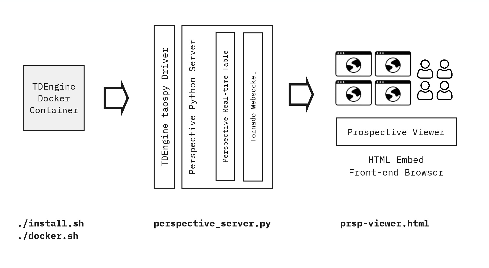

# TDengine <> Perspective Integration

This document explains how to configure Perspective with a TDengine data source. 



The architecture is as follow:

1. Instantiate a TDengine docker container and initialize it with data (using TAOS benchmark dataset).
2. Install TDengine python client libs (taospy).
3. Start a perspective-python server (`perspective_server.py`) which reads data periodically from TDengine and publishes it out to Perspective real-time Table via a Tornado Websocket.
4. Embed a Perspective viewer in HTML and connect to the backend Server.
5. Visualize and interact with TDengine data in real-time

<br/>

## Getting Started

### 1. Install TDengine client

Run the `install.sh` script to download and install the TDengine client libraries locally. This is necessary for the TDengine Python SDK (taospy) to function.

For more information on installing TDengine's client, please refer to [install client library](https://docs.tdengine.com/tdengine-reference/client-libraries/#install-client-driver) docs.

```sh
./install.sh
```

### 2. Check the client installation

After the install script runs, please verify if the everything is setup correctly.
- You should see a symlink for `libtaos.so` in:

```sh
ls -l tdengine-client/driver/

total 68488
lrwxrwxrwx 1 warthog warthog       18 Jan  7 16:08 libtaos.so -> libtaos.so.3.3.5.0
-rwxr-xr-x 1 warthog warthog 59186032 Dec 31 03:42 libtaos.so.3.3.5.0
-rwxr-xr-x 1 warthog warthog 10937480 Dec 31 03:42 libtaosws.so
-rw-r--r-- 1 warthog warthog        8 Dec 31 03:42 vercomp.txt
```

- Check if the client lib folder is correctly added to `$LD_LIBRARY_PATH`:

```sh
echo $LD_LIBRARY_PATH
```

`LD_LIBRARY_PATH` should have been added to your bash profile file. Please check to ensure that it is set properly.

If you don't see this line at the end of your `~/.bashrc` or `~/.bash_profile`, please add it:

```sh
export LD_LIBRARY_PATH="$LD_LIBRARY_PATH:$(pwd)/tdengine-client/driver"
```

### 3. Start a TDengine Docker container

Run the `docker.sh` script to start a TDengine container. This script will also wait for the database to initialize and populate it with data from the TDengine benchmark.

```sh
./docker.sh
```

For complete information on running TDengine docker engine, please refer to [Get Started with TDengine Using Docker](https://docs.tdengine.com/get-started/deploy-in-docker/) docs.

### 4. Activate your virtualenv

`install.sh` already sets up a virtual environment for you and installs the TDengine `taospy` client. If you need to activate it manually, use the following commands:

```sh
source venv/bin/activate

pip install --upgrade pip
pip install --upgrade -r requirements.txt
```

### 5. Run Perspective Server

Run the `perspective_server.py` script to start a Perspective server. This server will pull data from TDengine and stream it into a Tornado WebSocket.

```sh
python perspective_server.py
```
<br/><br/>

## Helpful Resources

- **TDengine client library examples including python and node.js:** Download [TDengine's client library](https://docs.tdengine.com/tdengine-reference/client-libraries/#install-client-driver) tar file and unpack it. Look inside the examples directory for a comprehensive list of examples.

- [TDengine Docker Container with Data](https://docs.tdengine.com/get-started/deploy-in-docker/)
- [TDengine SQL Reference](https://docs.tdengine.com/basic-features/data-querying/)
- [Inserting data into TDengine](https://docs.tdengine.com/basic-features/data-ingestion/)

Next steps:
- [Streaming data from TDengine](https://docs.tdengine.com/advanced-features/stream-processing/)
